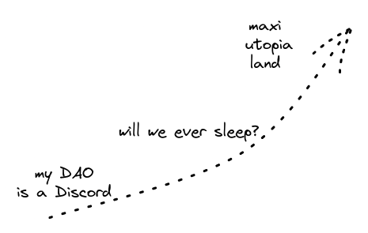

# Collaborate on DAOistry

## What is it for?
DAOistry is a little research project into what really works and doesn't in DAOs, and blockchain-related communities in general.

While it attempts to be practical (and somewhat critical) it also considers the long-term visions of what is possible. From this perspective, it seeks to reveal the new paradigms blockchains enable, and draw a line to those from what works today.

At a meta level, it's inspired by [Arthur Clarke's Profiles Of The Future](https://archive.org/details/profilesoffuture00clar) - essays which explored the ultimate perimeters of what various scientific domains could discover.

For me, here and now, it's a by-product of my own research, which aims to find fun and useful experiments to deploy to help people coordinate better with blockchains. (I'll be launching most of those from [🍵 Cuppa](https://cuppa.cc))

So letting the big visionary brains set the direction, but keeping it real about what to focus on next.

## Contribute!
With that in mind, I'd love to collaborate.  

You can see a lot is still pretty "drafty." So even little edits and fixes are welcome!

And it's be great if you have bigger ideas too. 

Here are some topics I plan to cover:
- [ ] Emergent structures
- [ ] Schelling points
- [ ] Nash equilibria in committee decision-making
- [ ] Implicit and natural collusion
- [ ] Silos and departments
- [ ] Meme power
- [ ] Vibes
- [ ] More meeting formats like retrospectives, kick-offs
- [ ] Ways of preserving and developing organisational knowledge
- [ ] Information radiators
- [ ] Clearly defining different consensus mechanisms
- [ ] Cooperation games
- [ ] Crypto as a massive set of parallel experiments "here we test in production ser" 
- [ ] Composability (for work coordination primitives)
- [ ] Compensation mechanisms

If you're looking into these or anything else that might be good here, let's talk!

Please [email me here](https://salimvirani.com/about).

Sal

